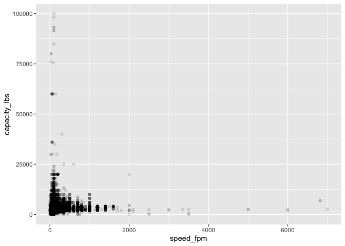

<!-- README.md is generated from README.Rmd. Please edit that file -->

# elevators 

<!-- badges: start -->
<!-- badges: end -->

This data package contains a data set of the registered elevator devices
in New York City provided by the Department of Buildings in response to
a September 2015 FOIL request.

## Installation

You can install the development version of elevators like so:

``` r
remotes::install_github("emilhvitfeldt/elevators")
```

## Examples

``` r
library(elevators)
library(ggplot2)

elevators |>
  ggplot(aes(speed_fpm, capacity_lbs)) +
  geom_point(alpha = 0.1) +
  annotate("point", 125, 3000, color = "red") +
  annotate("segment", x = 1000, xend = 225, y = 25000, yend = 6000,
           colour = "red", size = 1, arrow = arrow()) +
  annotate("text", x = 1500, y = 28000, label = "RStudio Office", color = "red")
```


